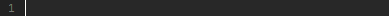

#  Tabstop nested  
* __Snippet for writing of snippets__  
* EJS function for insert snippet which contains literal '[[tabstop:]]'  


* INACTIVE TABSTOPS: put '~\~' between square brackets to deactivate tabstops in snippet  
* ACTIVE   TABSTOPS: snippet with active tabstops is defined in var tabstop_active  

#### Example in *.snippet  

``` JavaScript  
<%  
    var tabstop_active = '[[%tabstop:THIS IS ACTIVE TABSTOP]]'  
%>  
[~~[%tabstop:"[~~[%tabstop:tabstop_active]~~]"]~~]  
```  
#### Result in Komodo  
  