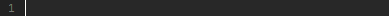

#  Tabstop nested  
* Make snippets for writing snippets  


#### Example in *.snippet  

``` JavaScript  
<%  
    var active_tabstop = '[[%tabstop:THIS IS ACTIVE TABSTOP]]'  
%>  
[[~~%tabstop:"[[~~%tabstop:placeholder]~~]"]~~]  
```  
#### Result in Komodo  
  