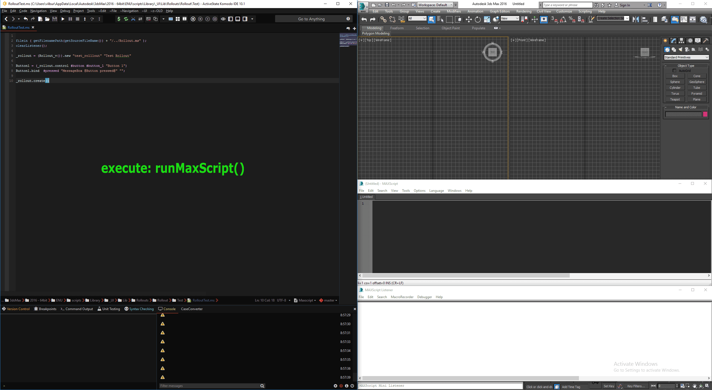

# runMaxScript  
* __Allows write maxscript in Komodo__  
	* __Execute current __*.ms__ or __*.mcr__  file in 3Ds Max__  
	* __Find error line in Komodo if script throws exception__  

------------------------------------------------------------------------------------  
1. Execute current file __*.ms__ or __*.mcr__ in 3Ds Max with __runMaxScript__.komodotool  
	`Executes current  file in 3Ds Max via drag-and-drop-to-max.ahk, if nothing selected`  
	`If text is selected, then send selected part of script to `3Ds Max` via ExternalMaxScriptIDE `  

* If script has error, then close `MAXScript exception window` with __go-to-line-if-exception.ahk__  
* Save __file__ & __position__ of error from  `MAXScript editor` to '__file-info.json__' with __get-line-info-from-max.ahk__  

* Run keyboard shortcut for __goToLineInKomodoIfException__.komodotool  

* Get __file__ & __position__ from '__file-info.json__'  and find error line in `Komodo`  

## Example  
  